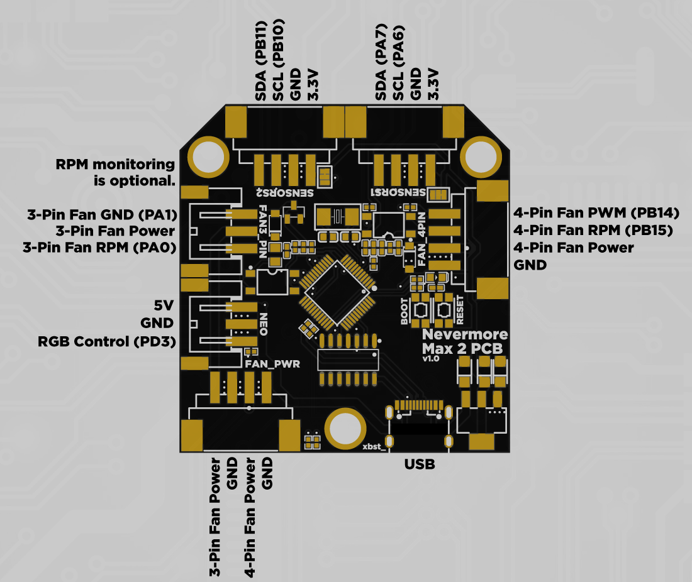

# Instructions

## 1. MCU Prep
### PCBs sold by me will come with the correct settings applied so you can skip this step. Self-sourced PCBs and PCBs sold by other vendors might not. So, to be safe I recommend following these instructions anyway.
### IMPORTANT: If you skip this step, you won't be able to reflash firmware after the initial flash.
1. Connect your PCB to your PC using a USB cable, while holding the BOOT button down.
2. Download and install [STM32Cube Programmer](https://www.st.com/en/development-tools/stm32cubeprog.html). (Do not download the latest version, it is buggy)
3. Select `USB` on the selector in top right of the program (below `Not connected`). Click the refresh button next to the port selector. Select `USB1` and click connect.
4. Select `OB` on the left side, expand `User Configuration`, uncheck `nBOOT_SEL`. Click `Apply`.

## 2. Flashing Klipper
1. SSH into your Raspberry Pi.
2. Go to the Klipper directory
```
cd klipper
```
3. Clean remaining files from previous build.
```
make clean
```
4. Choose the options for the build.
```
make menuconfig
```
Use the following options:
<details>
  <summary>Nevermore Max PCB & Nevermore StealthMax PCB (USB)</summary>

```
[*] Enable extra low-level configuration options
    Micro-controller Architecture (STMicroelectronics STM32)  --->
    Processor model (STM32G0B1)  --->
    Bootloader offset (No bootloader)  --->
    Clock Reference (8 MHz crystal)  --->
    Communication interface (USB (on PA11/PA12))  --->
    USB ids  --->
()  GPIO pins to set at micro-controller startup
```

</details>
<details>
  <summary>Nevermore StealthMax PCB (CAN - No CanBoot)</summary>

```
[*] Enable extra low-level configuration options
    Micro-controller Architecture (STMicroelectronics STM32)  --->
    Processor model (STM32G0B1)  --->
    Bootloader offset (No bootloader)  --->
    Clock Reference (8 MHz crystal)  --->
    Communication interface (CAN bus (on PB0/PB1))  --->
(1000000) CAN bus speed
()  GPIO pins to set at micro-controller startup
```

</details>
<details>
  <summary>Nevermore StealthMax PCB (CAN - CanBoot)</summary>

```
[*] Enable extra low-level configuration options
    Micro-controller Architecture (STMicroelectronics STM32)  --->
    Processor model (STM32G0B1)  --->
    Bootloader offset (8KiB Bootloader)  --->
    Clock Reference (8 MHz crystal)  --->
    Communication interface (CAN bus (on PB0/PB1))  --->
(1000000) CAN bus speed
()  GPIO pins to set at micro-controller startup
```

</details>

Press `Q` then `Y` to save and quit the menu.

5. Build.
```
make
```
<details>
  <summary>Nevermore Max PCB & Nevermore StealthMax PCB (USB)</summary>

  6. Connect your Nevermore Max/StealthMax PCB to your Raspberry Pi while holding down the `BOOT` button.
  7.  Use `lsusb` and find the device in DFU mode.
  8.   Flash. Replace the ID with the ID from the previous step.
  ```
  make flash FLASH_DEVICE=1234:5678
  ```
  9. When finished, press the `RESET` button on your Nevermore Max/StealthMax PCB.
  10. Check the serial connections and find the path startting with `/dev/serial/by-id/usb-Klipper_stm32g0b1`. This is the serial path of your Nevermore Max/StealthMax PCB.
  ```
  ls /dev/serial/by-id/*
  ```

</details>
<details>
  <summary>Nevermore StealthMax PCB (Non-CanBoot CAN)</summary>

  6. Connect your Nevermore Max/StealthMax PCB to your Raspberry Pi while holding down the `BOOT` button.
  7.  Use `lsusb` and find the device in DFU mode.
  8.   Flash. Replace the ID with the ID from the previous step.
  ```
  make flash FLASH_DEVICE=1234:5678
  ```
  9. When finished, press the `RESET` button on your Nevermore Max/StealthMax PCB.
  10. Find the CAN Bus UUID using the instrucitons on [Klipper's website](https://www.klipper3d.org/CANBUS.html#finding-the-canbus_uuid-for-new-micro-controllers)

</details>
<details>
  <summary>Nevermore StealthMax PCB (CAN - CanBoot)</summary>
  
  6. Install/Build CanBoot using the [instructions](https://github.com/Arksine/katapult) on its repo. Use these settings to build CanBoot:
  ```
    Micro-controller Architecture (STMicroelectronics STM32)  --->
    Processor model (STM32G0B1)  --->
    Build Katapult deployment application (Do not build)  --->
    Clock Reference (8 MHz crystal)  --->
    Communication interface (CAN bus (on PB0/PB1))  --->
    Application start offset (8KiB offset)  --->
(1000000) CAN bus speed
()  GPIO pins to set on bootloader entry
[*] Support bootloader entry on rapid double click of reset button
[ ] Enable bootloader entry on button (or gpio) state
[*] Enable Status LED
(PA13)  Status LED GPIO Pin
  ```
  7. Connect your Nevermore Max/StealthMax PCB to your Raspberry Pi while holding down the `BOOT` button. Flash CanBoot using the [instructions](https://github.com/Arksine/katapult) on its repo.
  8. When finished, press the `RESET` button on your Nevermore Max/StealthMax PCB.
  9. Flash the Klipper build we creater earlier using the [instructions](https://github.com/Arksine/katapult) on CanBoot's repo.
  10. Find the CAN Bus UUID using the instrucitons on [Klipper's website](https://www.klipper3d.org/CANBUS.html#finding-the-canbus_uuid-for-new-micro-controllers)
   
</details>


11. While you're SSH'd in, also download the python code needed for the SGP40 sensors from the [Nevermore Max repo](https://github.com/nevermore3d/Nevermore_Max).
```
sudo wget https://raw.githubusercontent.com/nevermore3d/Nevermore_Max/master/Software/Klipper/sgp40.py -P ~/klipper/klippy/extras
sudo wget https://raw.githubusercontent.com/nevermore3d/Nevermore_Max/master/Software/Klipper/voc_algorithm.py -P ~/klipper/klippy/extras
sudo service klipper restart
```
12. Run these commands if you are using Mainsail and want the SGP40s displayed on the dashboard:
```
cd ~/mainsail/
grep -l additionalSensors * -R | xargs sed -i 's+additionalSensors=\[+additionalSensors=\["sgp40",+g'
```

### 3. PCB Mount
Follow the instructions for your PCB:
<details>
  <summary>Nevermore Max PCB</summary>
  
  1. Print the ~~bottle opener~~ [Nevermore Max PCB tray](../Mounts/Nevermore-Max-PCB-Tray.stl) using the standard Voron print settings.
  2. Remove the built-in supports.
  3. Superglue 2 magnets. Pay attention to the polarities.
  4. Mount the PCB. The plastic latches will keep the PCB in place, no screws needed. The USB/power side should be seated first.
     
  
</details>
<details>
  <summary>Nevermore StealthMax PCB</summary>
  
  1. Mount the PCB where the Raspberry Pi Pico normally mounts with M2 screws.
</details>
  
### 4. Wiring
Follow the instructions for your PCB:
<details>
<summary>Nevermore Max PCB</summary>
 
  1. All connectors except USB are JST-XH. Use the diagram below to wire your fans/sensors/leds/power.

  
</details>
<details>
  <summary>Nevermore StealthMax PCB</summary>

  1. All connectors except USB are JST-PH. Use the diagram below to wire your fans/sensors/CAN/power.

  
</details>

### 5. Klipper Config
1. Download the [Klipper config](../Firmware/max.cfg), and upload it to your printer.
2. Open the file and edit according to your setup.
3. Add `[include max.cfg]` in your `printer.cfg`.
