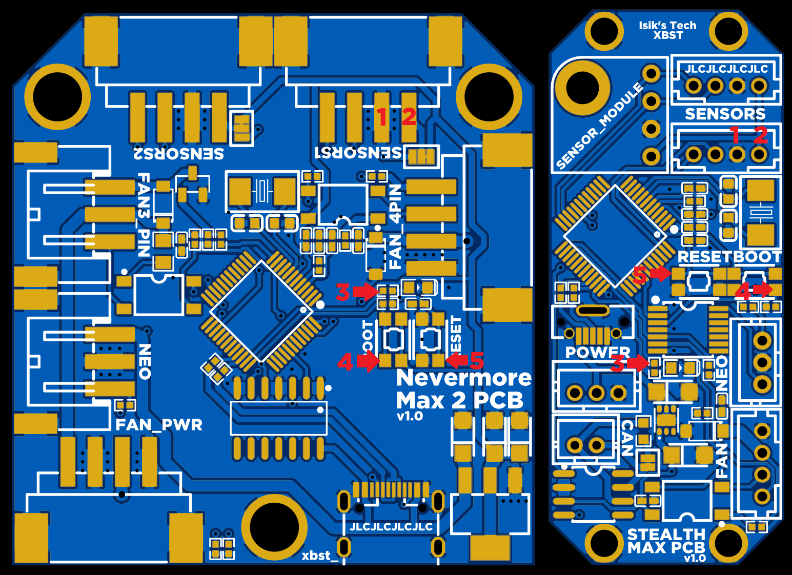

# ST-Link Instructions
If you cannot enter DFU mode by holding down the BOOT button, your PCB might be "bricked". Fortunately, it is possible to reverse this.
## Tools
### 1. ST-Link
|Source|Link|
|------|----|
|Amazon US|[Link](https://amzn.to/474WZEU)|
|Aliexpress|[Link](https://s.click.aliexpress.com/e/_DluRpA7)|
### 2. Dupont Wires
Your ST-Link might come with some in the package. If it doesn't:
|Source|Link|
|------|----|
|Amazon US|[Link](https://amzn.to/3SClTaO)|
|Aliexpress|[Link](https://s.click.aliexpress.com/e/_DDWGigj)|
### 3. Soldering Supplies
You'll need to solder some male dupont wires on the PCB, so you need a soldering iron and solder.
## Instructions


Connect your ST-Link wires to the pads highlighted above. If you have a Stealthmax PCB 2, the pads are on the backside, labeled.
| Pin | ST-Link |
|-----|---------|
|1    |GND      |
|2    |3.3V     |
|3    |SWDIO    |
|4    |SWCLK    |
|5    |RST      |

1. SSH into your Raspberry Pi
2. Install the software St-Link needs: ```sudo apt install cmake libusb-1.0-0-dev```
3. Download the ST-Link tools from GitHub: ```git clone https://github.com/stlink-org/stlink ~/stlink```
4. Go to the newly created stlink directory: ```cd ~/stlink```
5. Make: ```make release```
6. Copy the chip info to /usr: ```sudo cp -a ~/stlink/config/chips /usr/local/share/stlink```
7. Plug in the ST-Link
8. Test the connection: ```sudo st-flash --area=option read``` If you DON'T see a `unknown chip id` error, you can move on to the next step.
9. Reset the nBOOT_SEL setting: ```sudo ./build/Release/bin/st-flash --connect-under-reset --area=option write 0xfedffeaa```
10. If there were no errors, you should be able to enter DFU mode now. Unsolder all wires, connect your PCB while holding the BOOT button down. You should be able to see your PCB in DFU mode. You can use `lsusb` to see if it's in DFU mode.

## Notes
- This readme file contains affiliate links. I earn a comission on qualifying purchases.
