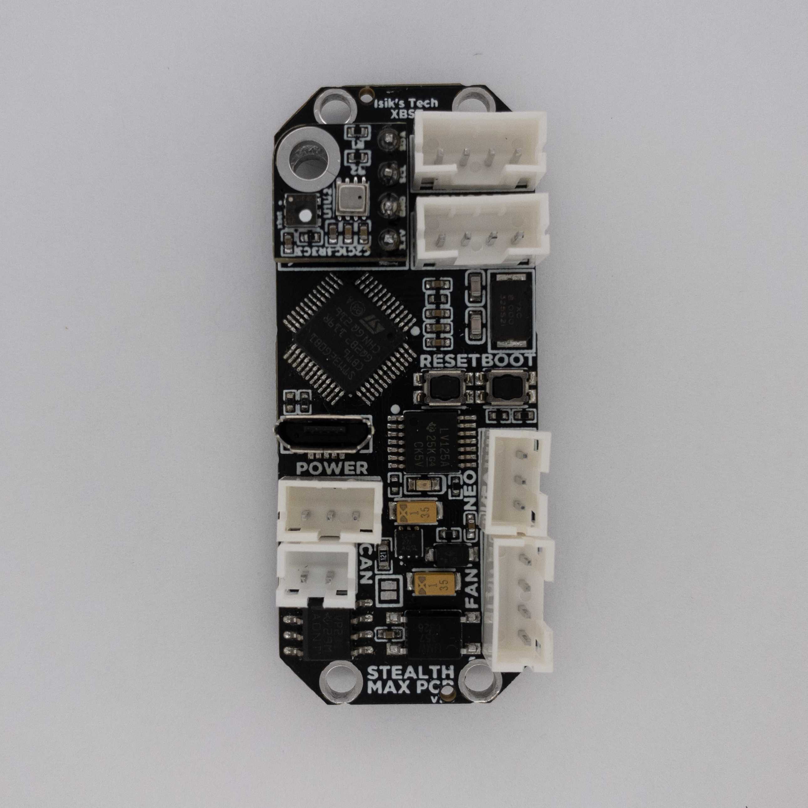
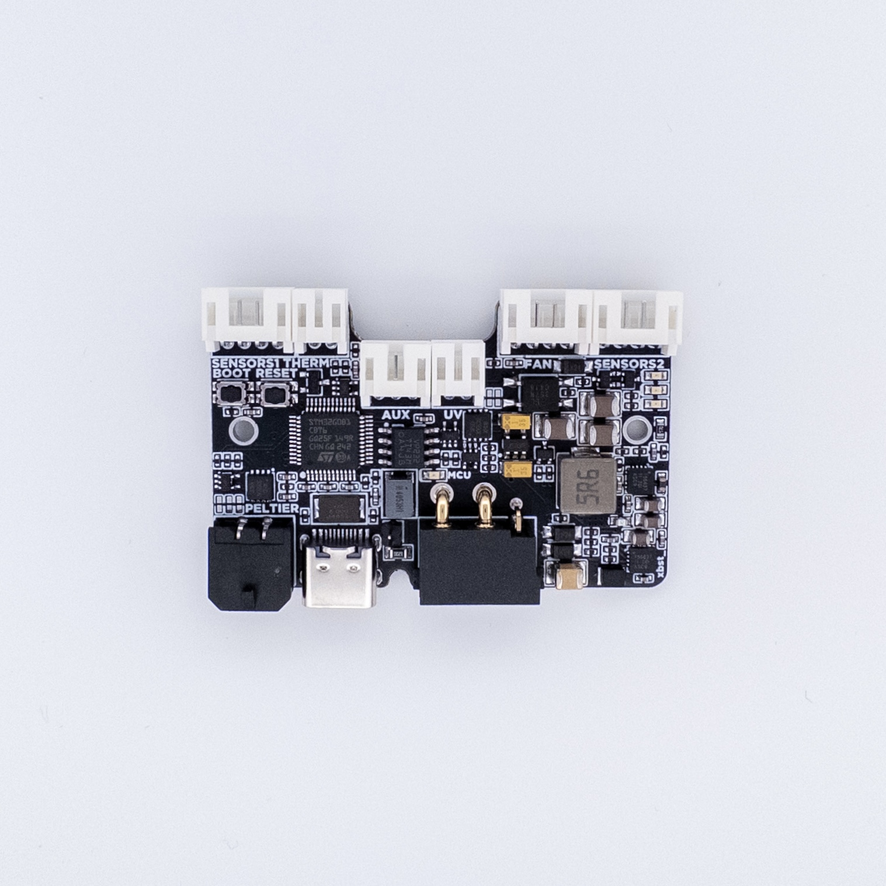

# Nevermore Mini, Max & StealthMax PCBs
| Nevermore Max 2 PCB | Nevermore Mini & Stealthmax PCB | Nevermore Stealthmax PCB 2|
| --- | --- | --- |
||||

 PCBs for Nevermore Mini, Nevermore Max and Nevermore Stealthmax air filters. 
 More information about the Nevermore Max 2 air filter can be found [here](https://github.com/nevermore3d/Nevermore_Max)
 More information about the Nevermore Stealthmax air filter can be found [here](https://github.com/nevermore3d/StealthMax)
 More information about the Nevermore Mini air filter can be found [here](https://www.printables.com/model/757663-nevermore-mini-3d-printer-hepa-and-carbon-air-filt).

### Features
|| Nevermore Max 2 PCB | Nevermore Mini & Stealthmax PCB | Nevermore Stealthmax PCB 2|
|---|---|---|---|
|MCU|STM32G0B1 MCU|STM32G0B1 MCU|STM32G0B1 MCU|
|Fans|1x 4-pin, 1x 3/2-pin|1x4-pin|1x4-pin|
|Sensors|2x HW I2C|2x HW I2C, 1x Optional Sensor Module Mount|2x HW I2C|
|Neopixels|1x Neopixel|1x Neopixel|-|
|CAN Bus|-|Yes|Yes|
|12V & 5V Regulators|-|-|Yes|
|UV LED Control|-|-|1x MOSFET, 1x PWM|
|Peltier Control|-|-|1x MOSFET|
|Thermistors|-|-|1x On-PCB, 1x Connector|
|Connectors|JST-XH, USB C|JST-PH, USB Micro-B|JST-PH, USB C, XT30(2+2), MX3.0|

## Purchasing a PCB
### United States
|Store|Max|Mini & Stealthmax|Stealthmax 2|
|---|---|---|---|
|Isik's Tech (Me)|[Max](https://store.isiks.tech/products/nevermore-max-controller-pcb)|[Mini & Stealthmax](https://store.isiks.tech/products/nevermore-stealthmax-pxb)|Soon|
|XR Bunker|[Max](https://xrbunker.works/products/nevermore-max-2-red-pcb-by-xbst_isik)|-||

This project is licensed under [GPL v3](./LICENSE), meaning vendors are allowed to sell PCBs without paying me. If you'd like to support the development of this and future projects please consider [sponsoring](https://github.com/sponsors/xbst) me on GitHub. You can also subscribe on [Patreon](https://l.isiks.tech/patreon) or [YouTube](https://l.isiks.tech/member).

You can also use the included gerber files to order your own from a PCB manufacturer like [PCBWay](https://www.pcbway.com/setinvite.aspx?inviteid=374841) or [JLCPCB](https://jlcpcb.com/).
 

## Instructions
- [Nevermore Max PCB](./Docs/Max.md)
- [Nevermore Mini & Stealthmax PCB](./Docs/SM.md)
- [Nevermore Stealthmax PCB 2](./Docs/SM2.md)

## YouTube

I am a YouTube content creator, and these projects were designed for my videos. If you want content about these projects & more, please consider [subscribing to my YouTube channel](https://www.youtube.com/channel/UClAWYmCkHjsbaX9Wz1df2mg).
 

If you feel like contributing to the development of this project and other projects like this you can sponsor me on [GitHub](https://github.com/sponsors/xbst), subscribe on [Patreon](https://l.isiks.tech/patreon) or [YouTube](https://l.isiks.tech/member).

## Notes
- This readme file contains affiliate links. I make a comission on qualifying purchases.
- This project does not come with any warranty, if you choose to build/use a Nevermore PCB, you are doing this at your own risk!
- If you want to sell PCBs, you are allowed to, and you will not owe me any royalties. **You cannot claim that I endorse the sale**. You can check the license file for more information. However, if you **wish** to give me a share you can sponsor me on [GitHub](https://github.com/sponsors/xbst), subscribe on [Patreon](https://l.isiks.tech/patreon) or [YouTube](https://l.isiks.tech/member).
